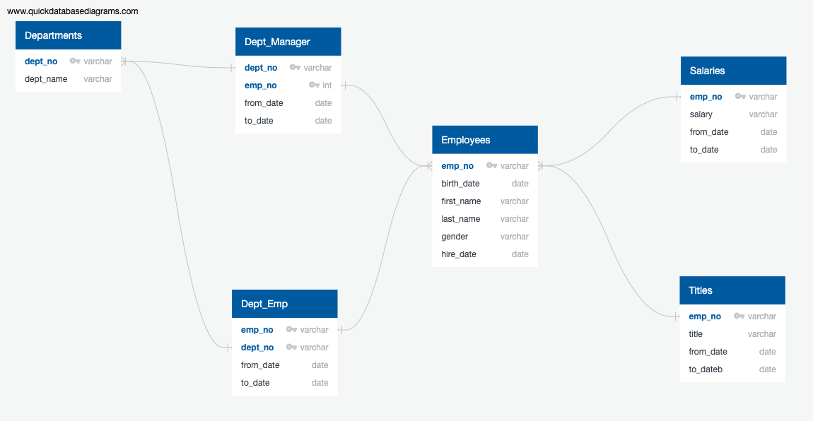
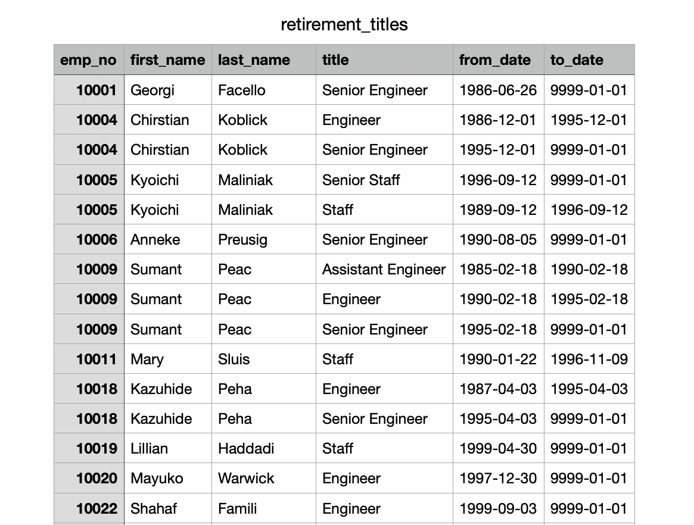
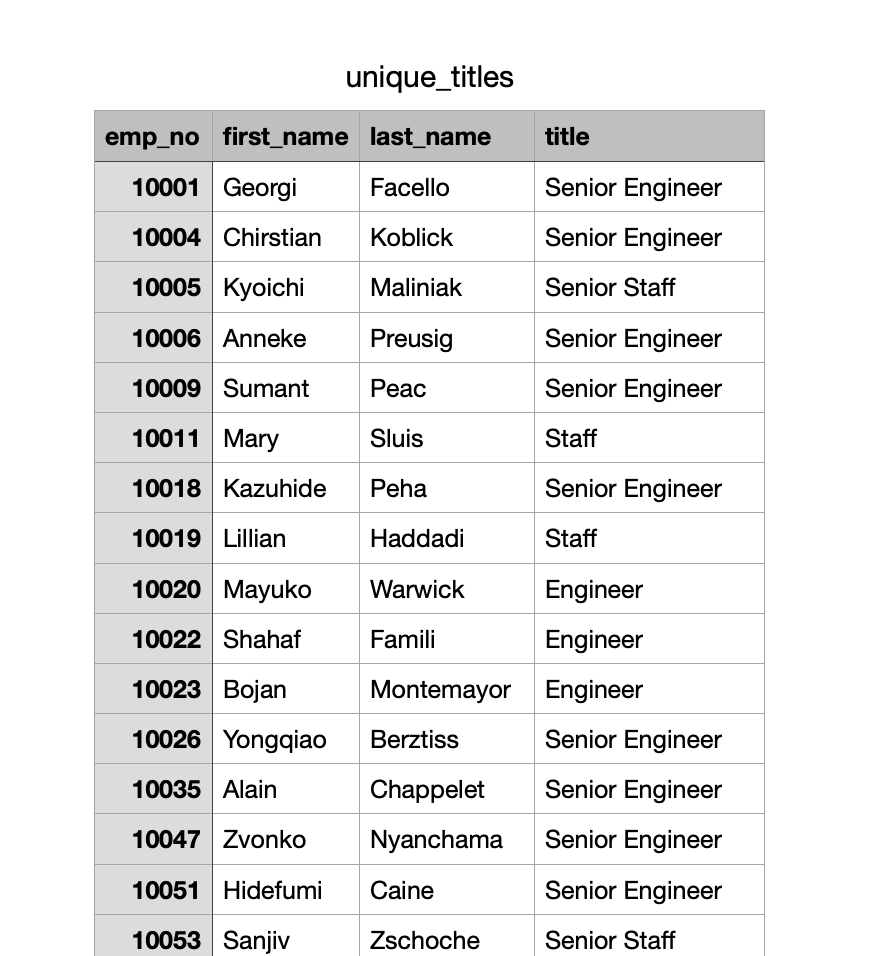
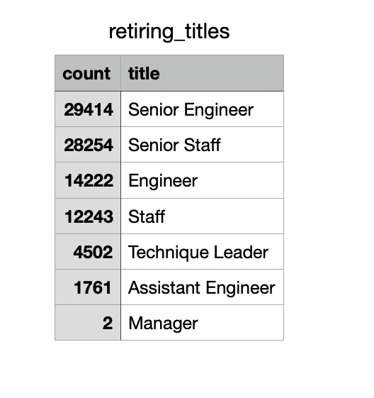
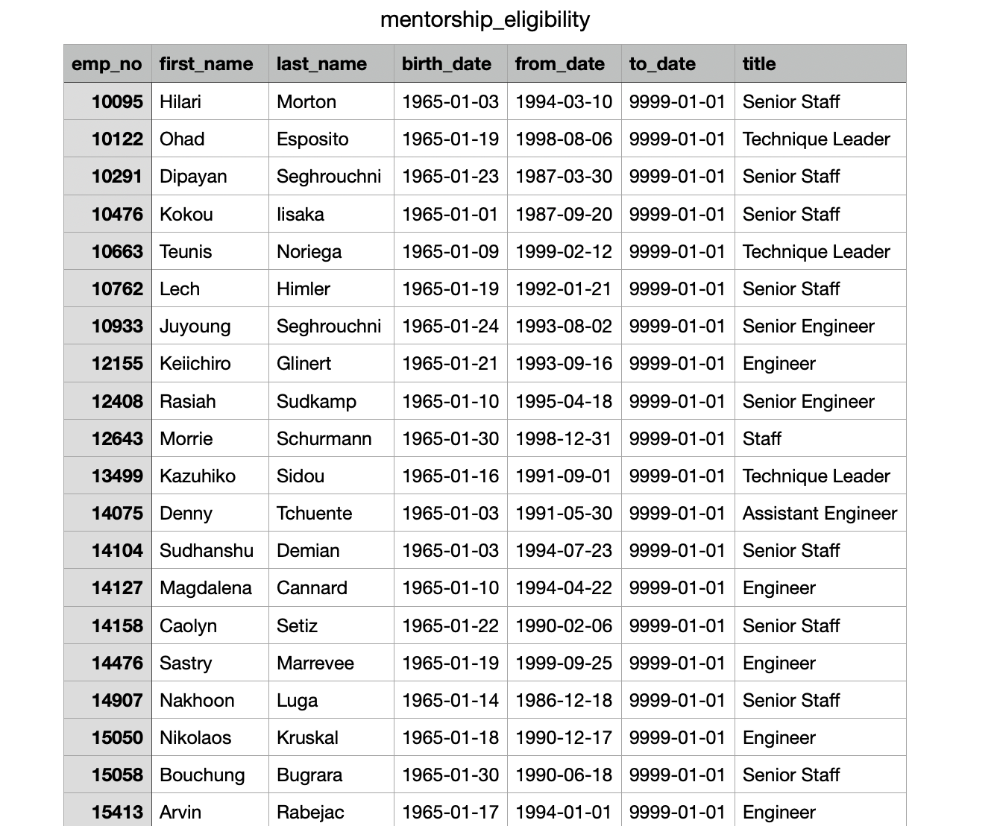
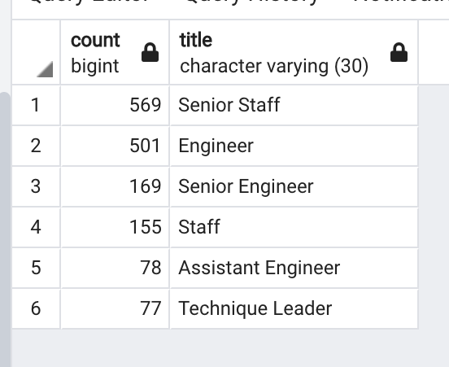
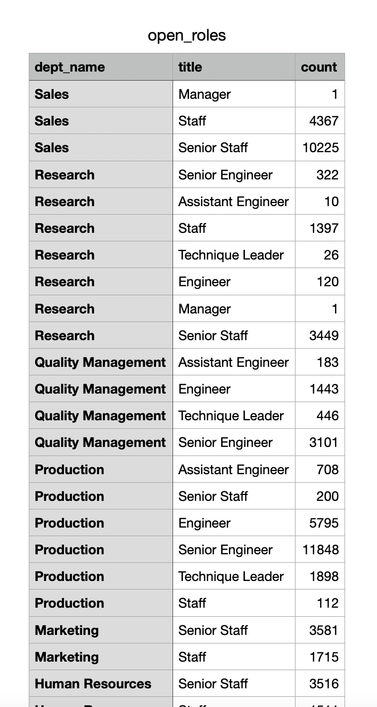

# Pewlett-Hackard-Analysis
## Background
 Pewlett Hackard company have requested to organize the company database by using PostgreSQL and pgAdmin. First, a map of the database will be created to show each table (csv.file) and determine the flow of data from one table to another using Quick Database Diagrams or ERD. Second, organize and create new tables that will help  Pewlett Hackard determine how many people will be retiring and , of those, employees, who is eligible for a retirement package.

 ## Resources:
 Software:
 * PostreSQL
 * pgAdmin 4
 * Quick DBD

## Purpose
The purpose of this analysis is to create tables that hold the number of retiring employees per title, and identify employees who are eligible to participate in a mentorship program.
## Overview
> Deliverable 1: The Number of Retiring Employees by Title

> Deliverable 2: The Employees Eligible for the Mentorship Program

> Deliverable 3: A written report on the employee database analysis (README.md)

### * Quick DataBase Diagrams: *

## Deliverable 1:
> 1. Using the ERD  and SQL queries, a Retirement Titles table that holds all the titles of employees who were born between January 1, 1952 and December 31, 1955 was created. 

> 2. Some employees may have multiple titles in the database using the DISTINCT ON statement a  unique_titles table was created that contains the most recent title of each employee. 

> 3. Then using the COUNT() function a  retiring_titles table was created that has the number of retirement-age employees by most recent job title. 

> 4. Finally, because we want to include only current employees in our analysis,those employees who have already left the company were excluded.

## Deliverable 2:
> 1. Using the ERD created as a reference and SQL queries, a mentorship-eligibility table that holds the current employees who were born between January 1, 1965 and December 31, 1965 was created.

## Results
1. The retirement_titles table shows all the eligible employees for retirement and how long they have worked at each position over the course of their career.
2. The unique_titles table shows the most recent title for each employee eligible for retirement.
3. As shown on the retiring_titles table the number of senior enginneer and senior staff that are retiring is approximately double the number of engineer and staff employees that are retiring. The number of managers that are retiring is the lowest out of all the titles, at two. The second lowest number of retiring employees by title is assistant enginner.
4. The mentorship_eligibility shows all the employees eligible to mentor and their most recent title.

## Summary
 ### * Asks: *

> How many roles will need to be filled as the "silver tsunami" begins to make an impact?

In total there will be over 90,000 roles that will need to be filled by the end of the "silver tsunami".

> Are there enough qualified, retirement-ready employees in the departments to mentor the next generation of Pewlett Hackard employees?
 
 There are (1,549) retirement-ready employees not enough in the departments to mentor the next generation of Pewlett Hackard employees if we assume a one to one ratio.

## Conclusion: 

Given that the majority of the employees of retirement age hold senior titles and that the number of employees eligible for retirement is greater than the number of eligible mentors, it is safe to say that there are not enough employees in the workforce to handle the immidiate departure of every employee who is eligible to retire.Therefore Pewlett Hackard should do an extensive planning on how to handle "silver tsunami".

### Additional:

1. A table should be created to hold the number of mentors per title. As shown :

2. A table should be created to hold the number of retirement eligible employees per department and by title. As shown:

